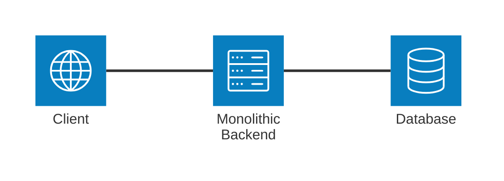
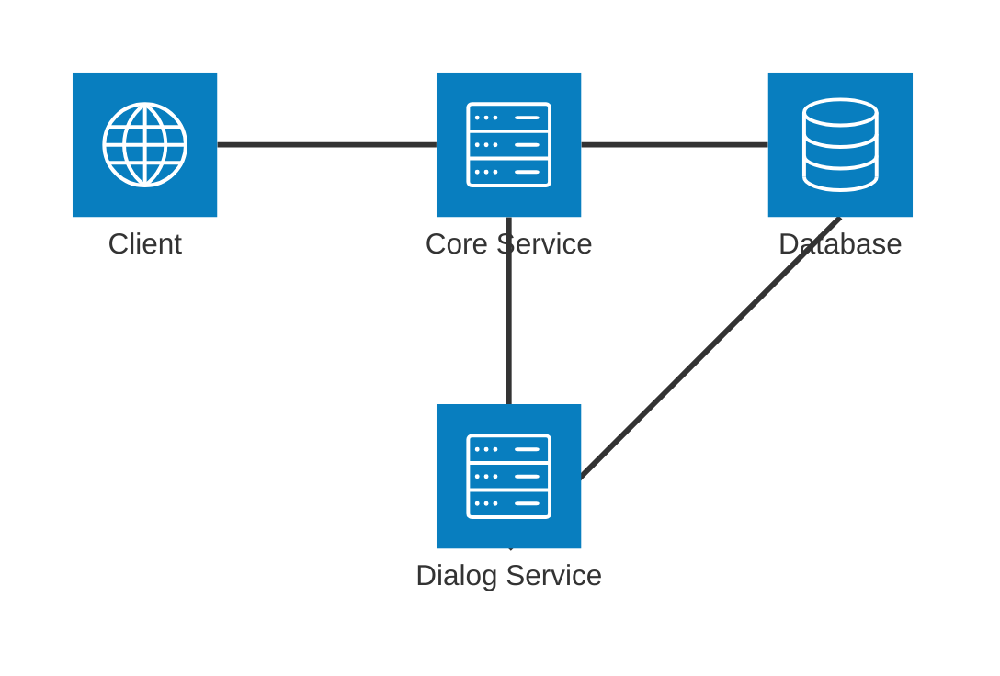

# Assignment #1

"Microservices and High-Load" course 1st homework assignment.

The task is to build a monolithic application and then decompose it moving a part of it to a new service saving backward compatibility - the monolithic application should proxy requests to the new service.

[Swagger documentation](/openapi.json) was provided for this assignment but it was not required to implement all endpoints, only some of them.

Postman collection with all endpoints was created and provided as a part of the assignment in the root directory.

All endpoints having `/dialog` in their path are required to be implemented in the **first stage** and then moved to a new service in the **second stage**.

Although not specified by the assignment, I decided to use [Node.js](https://nodejs.org/en/) for the monolithic application and [Go](https://golang.org/) for the new service.

Auth is implemented using [JSON Web Tokens](https://jwt.io/).

## How to run

Each stage of the assignment has its own directory. `cd` into the directory and run docker-compose file that will setup everything needed for the stage.

```bash
cd stage-1
# or
cd stage-2

docker compose up
```

Then you can send requests to the application using the provided Postman specification or any other tool you prefer.

## How to test

To easily test the application endpoints locally a [Postman](https://www.postman.com/) collection was provided in the root directory.

## Diagrams

### Stage 1



### Stage 2


